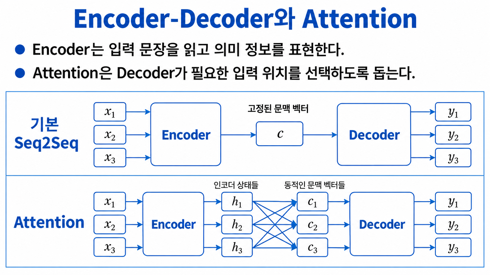
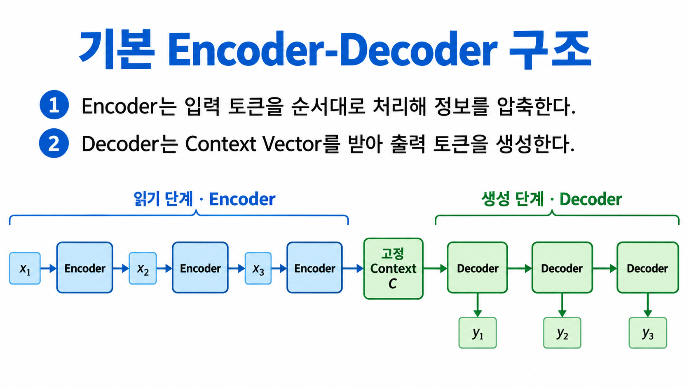
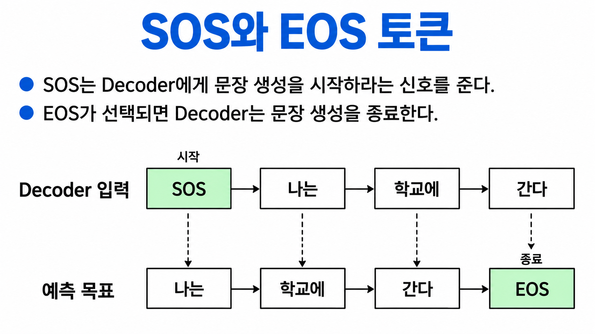
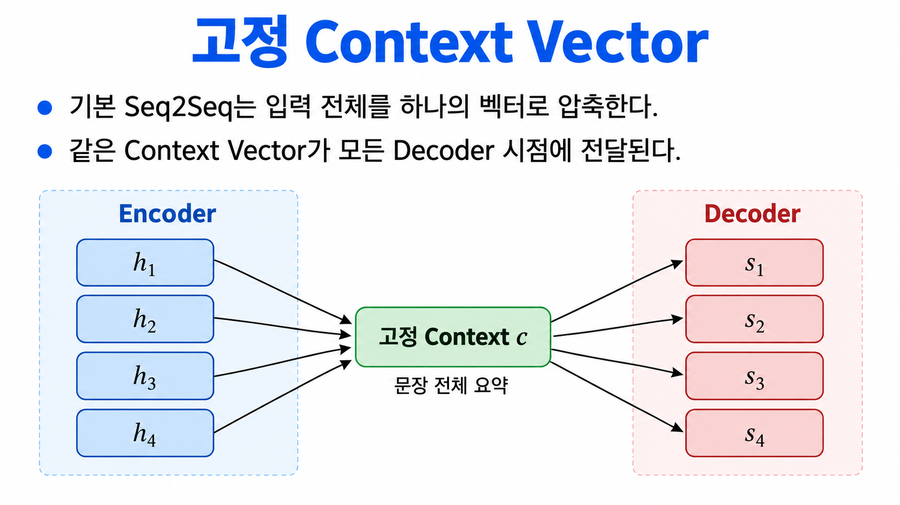
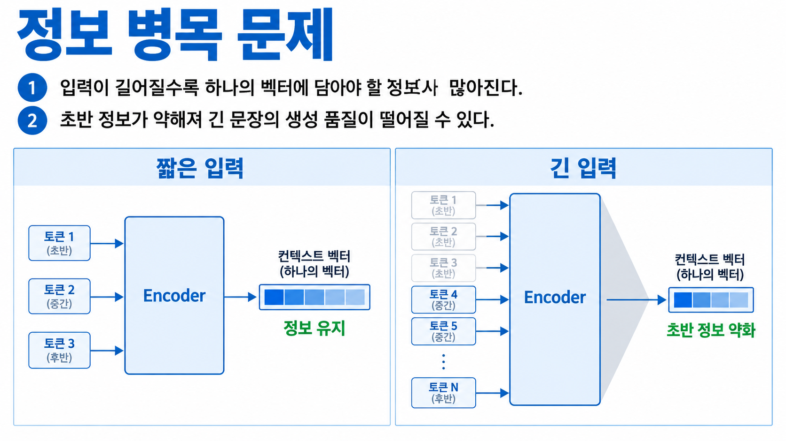
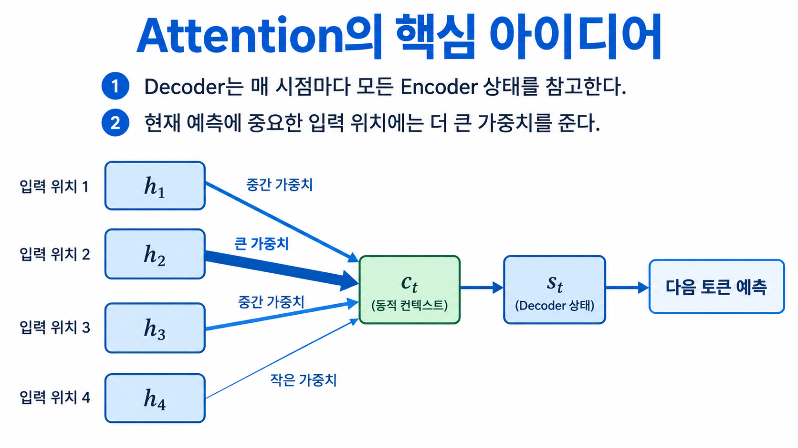
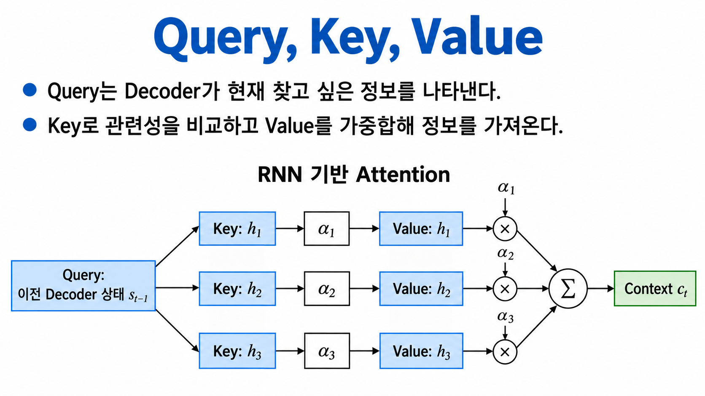
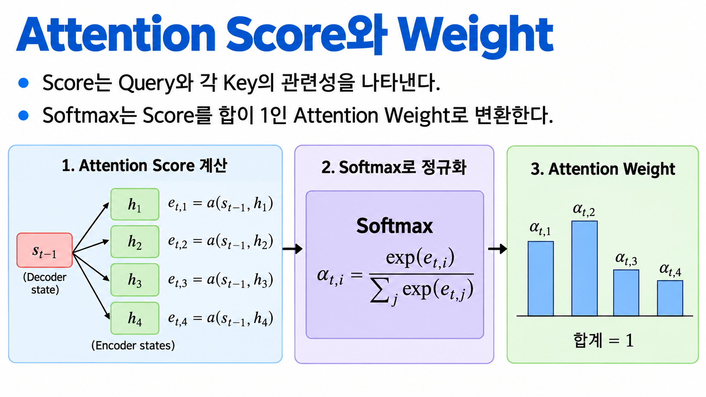
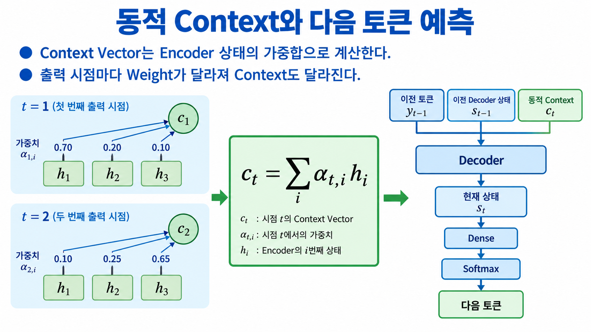

# Lecture 13. Encoder-Decoder와 Attention

Lecture 12에서는 하나의 LSTM이 이전 문자를 바탕으로 다음 문자를 생성했습니다. 이번 강의에서는 입력 문장을 읽는 Encoder와 출력 문장을 생성하는 Decoder를 분리한 Seq2Seq 구조를 살펴봅니다. 이어서 모든 입력 정보를 하나의 고정 Context Vector에 압축할 때 발생하는 정보 병목과 이를 개선하는 Attention의 기본 원리를 학습합니다.

## 학습 목표

- Encoder와 Decoder의 역할을 구분할 수 있습니다.
- 기본 Seq2Seq 모델의 생성 과정을 설명할 수 있습니다.
- SOS와 EOS 토큰의 역할을 설명할 수 있습니다.
- 고정 Context Vector에서 정보 병목이 발생하는 이유를 이해할 수 있습니다.
- Attention이 모든 Encoder 상태를 활용하는 방식을 설명할 수 있습니다.
- Query, Key, Value의 역할을 구분할 수 있습니다.
- Attention Score, Weight, Context Vector의 계산 순서를 이해할 수 있습니다.

> 이 장에서는 RNN 기반 Encoder-Decoder와 Attention의 원리를 다룹니다. Keras를 기본 프레임워크로 사용하며, PyTorch 버전은 추후 별도의 링크로 제공합니다.

---

## 1. Encoder-Decoder 모델이 필요한 이유

입력과 출력의 길이가 서로 다른 생성 문제에서는 입력을 처리하는 부분과 출력을 만드는 부분을 나누는 것이 유용합니다.



```text
입력 문장 → Encoder → 입력 정보 표현
                         ↓
출력 문장 ← Decoder ← 생성에 필요한 정보
```

| 구성 요소 | 역할 |
|---|---|
| Encoder | 입력 토큰을 순서대로 읽고 상태를 생성 |
| Context | Encoder가 Decoder에 전달하는 입력 정보 |
| Decoder | Context와 이전 출력 토큰을 이용해 다음 토큰 생성 |

대표적인 예는 기계 번역입니다.

```text
입력: I love deep learning.
출력: 나는 딥러닝을 좋아한다.
```

입력 문장과 출력 문장은 길이와 토큰 구성이 다르지만 의미는 연결되어야 합니다.

---

## 2. 기본 Encoder-Decoder 구조

Encoder는 입력 문장을 읽고, Decoder는 전달받은 Context Vector를 이용해 출력 토큰을 한 개씩 생성합니다.



```text
입력 x₁ → x₂ → x₃
        Encoder
           ↓
  고정 Context Vector c
           ↓
        Decoder
출력 y₁ → y₂ → y₃
```

Encoder의 LSTM은 입력 시퀀스를 처리한 후 마지막 은닉 상태와 셀 상태를 Decoder에 전달할 수 있습니다.

```python
encoder_inputs = keras.Input(shape=(None,))
encoder_x = layers.Embedding(src_vocab_size, embed_dim)(encoder_inputs)

encoder_lstm = layers.LSTM(
    hidden_size,
    return_state=True,
)

_, encoder_h, encoder_c = encoder_lstm(encoder_x)
encoder_states = [encoder_h, encoder_c]
```

Decoder는 이 상태를 초기 상태로 사용합니다.

```python
decoder_inputs = keras.Input(shape=(None,))
decoder_x = layers.Embedding(tgt_vocab_size, embed_dim)(decoder_inputs)

decoder_lstm = layers.LSTM(
    hidden_size,
    return_sequences=True,
    return_state=True,
)

decoder_outputs, _, _ = decoder_lstm(
    decoder_x,
    initial_state=encoder_states,
)
```

이 코드는 구조를 이해하기 위한 핵심 부분입니다. 실제 학습에서는 입력·출력 문장 쌍, 패딩과 마스크, 손실 계산이 추가됩니다.

---

## 3. SOS와 EOS 토큰

Decoder에는 생성을 시작하고 종료할 수 있는 신호가 필요합니다.



| 특수 토큰 | 의미 | 역할 |
|---|---|---|
| SOS | Start of Sequence | Decoder에게 생성을 시작하도록 알림 |
| EOS | End of Sequence | 문장 생성의 종료를 알림 |

학습할 때 Decoder 입력과 목표는 한 칸 이동된 형태로 구성합니다.

```text
출력 문장: 나는 학교에 간다

Decoder 입력: SOS  나는   학교에 간다
학습 목표   : 나는 학교에 간다   EOS
```

추론에서는 다음 과정을 반복합니다.

```text
SOS 입력
  ↓
다음 토큰 예측
  ↓
예측 토큰을 다음 입력으로 사용
  ↓
EOS가 선택되면 종료
```

Lecture 11의 자기회귀 생성과 같은 원리이며, Decoder가 Encoder의 입력 정보도 함께 사용한다는 점이 다릅니다.

---

## 4. 고정 Context Vector

기본 Seq2Seq 모델에서는 Encoder의 마지막 상태 하나가 입력 문장 전체를 요약합니다.



```text
h₁, h₂, h₃, ..., hₙ
          ↓
고정 Context Vector c
          ↓
s₁, s₂, s₃, ..., sₘ
```

동일한 Context Vector가 모든 Decoder 시점에 전달됩니다.

| 장점 | 한계 |
|---|---|
| 구조가 단순함 | 하나의 벡터에 모든 입력 정보를 압축 |
| 입력·출력 길이가 달라도 처리 가능 | 긴 문장에서 초반 정보가 약해질 수 있음 |
| Encoder와 Decoder를 분리 가능 | 출력 시점마다 필요한 입력 정보가 달라도 같은 벡터 사용 |

고정 Context Vector의 크기를 키우면 더 많은 정보를 담을 수 있지만, 입력 길이가 계속 증가할 때 정보 손실 문제를 완전히 해결하지는 못합니다.

---

## 5. 정보 병목 문제

정보 병목(information bottleneck)은 많은 입력 정보를 제한된 하나의 벡터에 압축하면서 일부 정보가 약해지는 문제입니다.



```text
짧은 입력 → 하나의 벡터에 비교적 쉽게 요약
긴 입력   → 하나의 벡터에 담아야 할 정보 증가
```

예를 들어 긴 문장을 번역할 때 Decoder가 마지막 단어를 생성하려면 입력 문장의 특정 초반 표현을 다시 확인해야 할 수 있습니다. 하지만 기본 Seq2Seq에서는 마지막 Context Vector만 전달되므로 필요한 입력 위치를 직접 선택하기 어렵습니다.

정보 병목은 다음 상황에서 더 크게 나타날 수 있습니다.

- 입력 문장이 길 때
- 멀리 떨어진 단어 사이의 관계가 중요할 때
- 입력의 세부 정보를 정확하게 출력해야 할 때
- 출력 시점마다 참고해야 할 입력 위치가 달라질 때

---

## 6. Attention의 핵심 아이디어

Attention은 하나의 고정 Context Vector만 사용하는 대신 모든 Encoder 상태를 보관합니다. Decoder는 출력 시점마다 현재 예측에 중요한 입력 위치를 선택합니다.



```text
Encoder 상태: h₁  h₂  h₃  h₄
                ↘ ↓ ↙
             가중치 적용
                  ↓
       시점별 Context Vector cₜ
                  ↓
          Decoder 상태 sₜ
```

Attention에서 “선택”은 하나의 위치만 고르는 것이 아닙니다. 각 입력 위치에 0과 1 사이의 가중치를 주고 가중합을 계산합니다.

```text
더 관련된 입력 위치 → 큰 가중치
덜 관련된 입력 위치 → 작은 가중치
```

출력 시점이 바뀌면 가중치도 달라지므로 Context Vector 역시 동적으로 바뀝니다.

---

## 7. Query, Key, Value

Query, Key, Value는 Attention이 필요한 정보를 찾고 가져오는 과정을 설명하는 개념입니다.



RNN 기반 Attention에서는 다음과 같이 이해할 수 있습니다.

| 요소 | 이 강의에서의 값 | 역할 |
|---|---|---|
| Query | 이전 Decoder 상태 $s_{t-1}$ | 현재 출력 시점에서 찾고 싶은 정보 |
| Key | 각 Encoder 상태 $h_i$ | Query와 관련성을 비교할 대상 |
| Value | 각 Encoder 상태 $h_i$ | Attention Weight로 가중합할 실제 정보 |

기본 RNN Attention에서는 같은 Encoder 상태가 Key와 Value로 사용될 수 있습니다.

```text
Query와 Key 비교 → 관련성 점수
관련성 점수 정규화 → Attention Weight
Weight와 Value 결합 → Context Vector
```

Transformer에서도 Query, Key, Value라는 용어를 사용하지만, 일반적으로 입력 상태를 서로 다른 가중치 행렬로 변환하여 만듭니다. 여기서는 RNN 기반 Attention의 직관에 집중합니다.

---

## 8. Attention Score와 Weight

먼저 이전 Decoder 상태와 각 Encoder 상태의 관련성을 계산합니다.



$$
e_{t,i}=a(s_{t-1},h_i)
$$

- $t$: 현재 Decoder 출력 시점
- $i$: Encoder 입력 위치
- $e_{t,i}$: 현재 출력과 입력 위치 $i$의 관련성 점수
- $a(\cdot)$: 관련성을 계산하는 Score 함수

Score가 클수록 해당 입력 위치가 현재 예측에 더 관련되어 있다는 뜻입니다. Score는 아직 확률이 아니므로 양수, 음수 또는 큰 값이 될 수 있습니다.

Softmax를 적용하면 Score가 합이 1인 Attention Weight로 변환됩니다.

$$
\alpha_{t,i}
=\frac{\exp(e_{t,i})}
{\sum_j \exp(e_{t,j})}
$$

$$
\sum_i \alpha_{t,i}=1
$$

| 단계 | 값 | 의미 |
|---|---|---|
| Score | $e_{t,i}$ | Query와 Key의 관련성 |
| Softmax | - | 입력 위치 전체에서 정규화 |
| Weight | $\alpha_{t,i}$ | 각 위치를 참고할 비율 |

Softmax는 문자 후보가 아니라 Encoder의 입력 위치 방향으로 적용한다는 점이 중요합니다.

---

## 9. 동적 Context Vector와 다음 토큰 예측

Attention Weight와 Encoder 상태의 가중합으로 현재 Decoder 시점의 Context Vector를 만듭니다.



$$
c_t=\sum_i \alpha_{t,i}h_i
$$

출력 시점마다 Attention Weight가 바뀌므로 Context Vector도 바뀝니다.

```text
출력 시점 t=1 → Weight α₁ → Context c₁
출력 시점 t=2 → Weight α₂ → Context c₂
출력 시점 t=3 → Weight α₃ → Context c₃
```

Decoder는 이전 출력 토큰, 이전 상태, 동적 Context Vector를 이용해 현재 상태를 갱신합니다.

```text
이전 출력 yₜ₋₁
이전 Decoder 상태 sₜ₋₁
동적 Context Vector cₜ
          ↓
      Decoder
          ↓
현재 Decoder 상태 sₜ
          ↓
Dense → Softmax → 다음 토큰 확률
```

다음 토큰 확률을 간단히 나타내면 다음과 같습니다.

$$
P(y_t\mid y_{<t},x)=\operatorname{softmax}\left(W_o[s_t;c_t]+b_o\right)
$$

$[s_t;c_t]$는 Decoder 상태와 Context Vector를 연결한 벡터입니다.

---

## 10. Attention Heatmap 읽기

Attention Weight를 행렬로 모으면 출력 토큰이 어떤 입력 위치를 많이 참고했는지 Heatmap으로 표현할 수 있습니다.

| Heatmap 축 | 의미 |
|---|---|
| 가로축 | 입력 토큰 위치 |
| 세로축 | 출력 토큰 위치 |
| 진한 셀 | 상대적으로 큰 Attention Weight |

번역 예제에서는 특정 출력 단어가 의미상 대응하는 입력 단어에 높은 Weight를 보일 수 있습니다. 그러나 Heatmap은 모델의 내부 가중치를 보여주는 보조 자료이며, 항상 완전한 인과적 설명을 제공하는 것은 아닙니다.

---

## 11. RNN 기반 Attention의 한계

Attention은 고정 Context Vector의 정보 병목을 완화하지만 RNN의 순차 계산 자체를 제거하지는 않습니다.

```text
s₁ → s₂ → s₃ → s₄
```

현재 Decoder 상태를 계산하려면 이전 Decoder 상태가 필요합니다. 따라서 출력 시점 전체를 동시에 계산하기 어렵습니다.

| 개선된 점 | 남아 있는 한계 |
|---|---|
| 모든 Encoder 상태를 참고 | Encoder와 Decoder의 RNN 계산은 순차적 |
| 출력 시점마다 Context 변경 | 긴 시퀀스에서 계산 시간이 증가 |
| 입력의 특정 위치에 집중 | 앞 상태에 대한 의존성이 남음 |

이후 Transformer에서는 순환 구조 대신 Self-Attention과 Positional Encoding을 이용해 시퀀스를 처리합니다.

---

## 12. 전체 계산 순서

RNN 기반 Attention의 한 시점 계산은 다음 순서로 정리할 수 있습니다.

```text
1. Encoder가 입력 위치별 상태 hᵢ를 만든다.
2. 이전 Decoder 상태 sₜ₋₁를 Query로 사용한다.
3. Query와 각 Encoder 상태의 Score eₜ,ᵢ를 계산한다.
4. Softmax로 Attention Weight αₜ,ᵢ를 만든다.
5. Encoder 상태를 가중합하여 Context cₜ를 만든다.
6. Decoder 상태 sₜ를 갱신한다.
7. Dense와 Softmax로 다음 토큰 확률을 계산한다.
8. 선택한 토큰을 다음 Decoder 입력으로 사용한다.
```

```text
Query + Keys
     ↓ Score
Attention Scores
     ↓ Softmax
Attention Weights
     ↓ Values의 가중합
Dynamic Context
     ↓ Decoder + Dense + Softmax
Next Token
```

---

## 핵심 정리

- Encoder는 입력 문장을 읽고 Decoder는 출력 문장을 생성합니다.
- SOS는 생성을 시작하고 EOS는 생성을 종료합니다.
- 기본 Seq2Seq는 입력 전체를 하나의 고정 Context Vector에 압축합니다.
- 긴 입력에서는 하나의 벡터에 모든 정보를 담으면서 정보 병목이 발생할 수 있습니다.
- Attention은 모든 Encoder 상태를 보관하고 출력 시점마다 다른 Weight를 계산합니다.
- Query와 Key의 관련성으로 Score를 만들고 Softmax로 Weight를 계산합니다.
- Context Vector는 Attention Weight와 Value의 가중합입니다.
- RNN 기반 Attention은 정보 병목을 완화하지만 Decoder의 순차 계산은 남아 있습니다.
